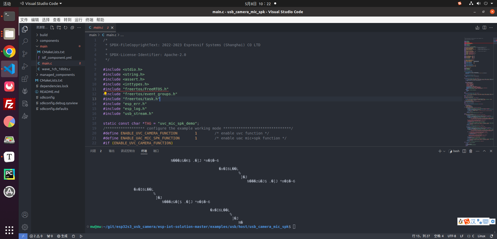
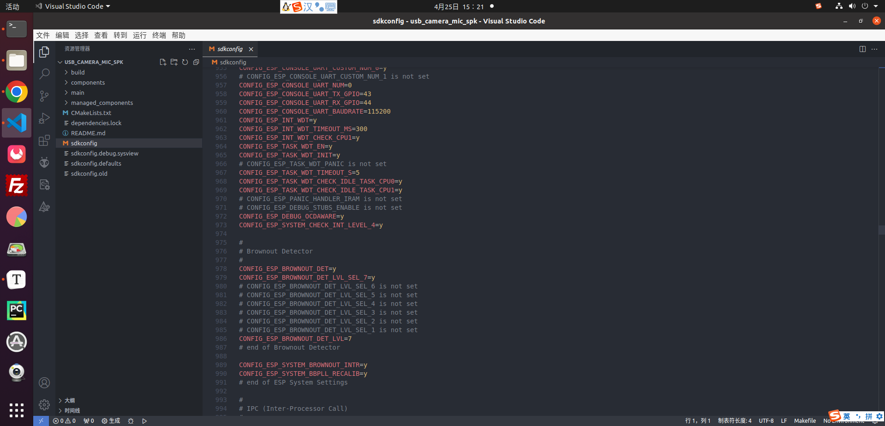
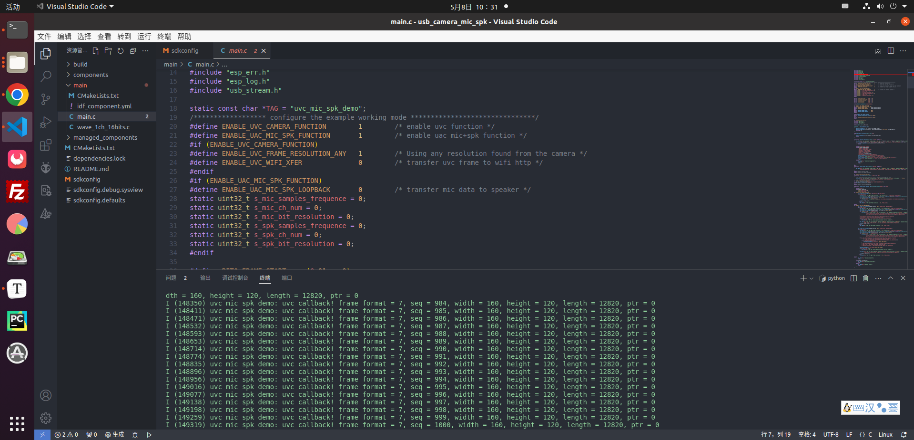
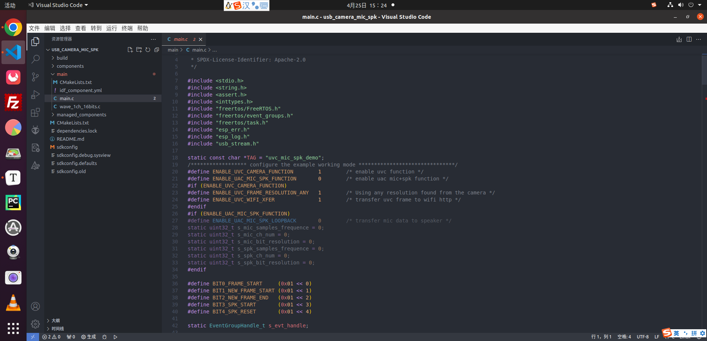
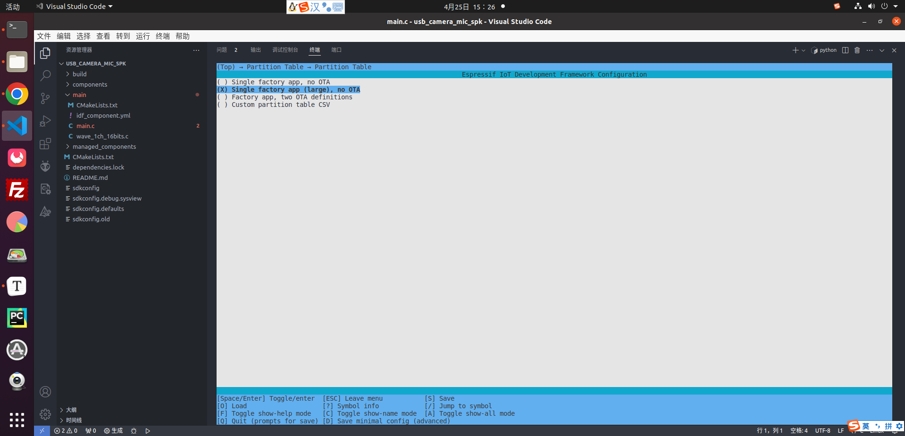
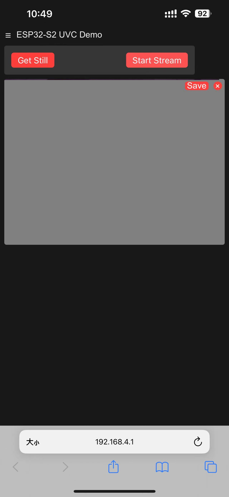

# 说明

使用官网(https://github.com/espressif/esp-iot-solution/tree/master)的提供usb_camera_mic_spk(~/git/01.my_git/esp32s3_usb_camera/my_esp_idf/esp-iot-solution-master/examples/usb/host$ ) 跑通了微雪 摄像头模块 树莓派 IMX179模组 800万像素 内置麦克风免驱动

# 1.命令行：

> ```linux
> . $HOME/esp/esp-idf/export.sh
> idf.py set-target esp32s3
> idf.py menuconfig
> idf.py build
> sudo chmod 777 /dev/ttyUSB0 
> idf.py -p /dev/ttyUSB0 flash
> idf.py -p /dev/ttyUSB0 monitor
> 
> 
> git add README.md //添加README.md
> git commit -m "add readme three" //添加提交内容
> git branch -M main //添加到的分支
> git push -u origin main //上传添加修改的文件 填写账号名和个人令牌
> 
> git status //状态查看
> git add . //追踪
> git config -l //配置查看
> git config --unset XXX //取消某些配置
> git commit -m "xxx" // 提交
> git push -u 名称 分支 //上传
> git log --oneline --decorate --graph --all //查看分支结构
> git branch -d xxx //删除本地分支
> git checkout xxx //切换分支
> git checkout -b xxx //新建本地分支
> git merge --no-ff xxx //不采用快照ff模式，合并到xxx位置
> git pull --rebase //将远端仓库的修改和本地的修改进行合并形成最新的提交
> git push origin xxx //建好本地分支后，在输入该指令建立远程分支
> git push origin ：xxx //删除远程分支但是不会删除本地分支
> ```

# 2.开发过程

使用过程步骤及所遇到的问题

## 0.使用vscode打开usb_camera_mic_spk，使用命令行运行程序

```
. $HOME/esp/esp-idf/export.sh
idf.py set-target esp32s3
sudo chmod 777 /dev/ttyUSB0 
idf.py -p /dev/ttyUSB0 flash
idf.py -p /dev/ttyUSB0 monitor
```

下载成功，打印出现乱码



## 1.串口设置：

将sdkconfig文件夹下的960行 改为CONFIG_ESP_CONSOLE_UART_BAUDRATE=115200



更新后打印信息为这个，则代表获取到图像信息了



## 2.wifi启用设置：

修改main.c文件

> ```
> #define ENABLE_UVC_CAMERA_FUNCTION        1        /* enable uvc function */
> #define ENABLE_UAC_MIC_SPK_FUNCTION       0        /* enable uac mic+spk function */
> #if (ENABLE_UVC_CAMERA_FUNCTION)
> #define ENABLE_UVC_FRAME_RESOLUTION_ANY   1        /* Using any resolution found from the camera */
> #define ENABLE_UVC_WIFI_XFER              1        /* transfer uvc frame to wifi http */
> ```



## 3.启动分区设置：



## 4.摄像头识别问题：

测试使用的是ov2710 可以识别到驱动，但是获取不到图片信息。
后来改用 IMX179可以获取图片信息

## 5.wifi查看图像信息问题

wifi设置后电脑应该可以搜索到

> ```
> esp32s3-uvc 这个wifi名称
> 服务器访问地址在打印信息栏：ip 地址会变化
> I (1053) camera wifi: wifi_init_softap finished.SSID:ESP32S3-UVC password:
> I (1057) phy_init: phy_version 640,cd64a1a,Jan 24 2024,17:28:12
> I (1100) wifi:mode : softAP (f4:12:fa:9e:fb:09)
> I (1101) wifi:Total power save buffer number: 16
> I (1102) wifi:Init max length of beacon: 752/752
> I (1103) wifi:Init max length of beacon: 752/752
> I (1108) camera_httpd: Starting web server on port: '80'
> I (1109) esp_netif_lwip: DHCP server started on interface WIFI_AP_DEF with IP: 192.168.4.1
> I (1124) camera_httpd: Starting stream server on port: '81'
> ```

用手机连接wifi后在浏览器输入192.168.4.1，就可以看到如下图



6.图像显示不全问题：

安装sudo apt install guvcview 在ubuntu上查看是否正常

> ```
> sudo apt install guvcview 安装
> guvcview 打开
> ```